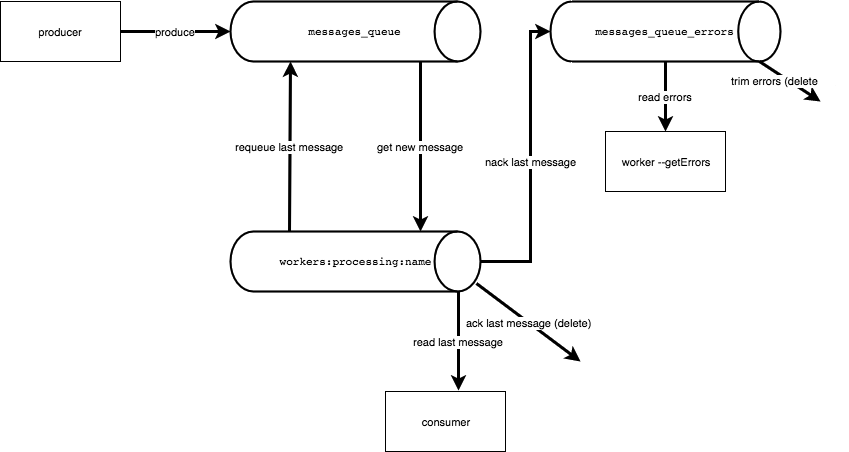
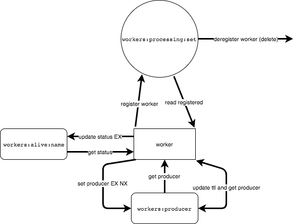

# onetwotrip-test-1

### Usage

#### docker-compose
You can run multiple workers and single instance of redis using docker-compose:
 1. From source folder build worker image: ```docker build -f Dockerfile -t onetwotrip-test-1-worker:latest .```
 2. Run ```docker-compose up --scale worker=3 -d redis worker```
 3. See workers logs: ```docker-compose logs worker```
 4. To see errors run ```docker-compose up worker-get-errors``` and to requeue lost processing messages ```docker-compose up worker-requeue```
 5. ```docker ps``` then ```docker kill worker-N``` to kill container 
 6. Stop all services: ```docker-compose down```

#### locally
 1. Install deps ```npm i```
 2. Install and run redis ```redis-server```
 3. Run worker ```npm run worker```. If you have redis host or port different to default (localhost: 6379), provide it via env vars: __REDIS_HOST__ and __REDIS_PORT__
 4. Check errors ```npm run errors``` and requeue lost processing messages ```npm run requeue```

### Testing
 1. ```npm test``` to run both unit and functional tests
 2. ```npm run lint``` to run linter
 3. ```npm run coverage``` to see unit tests coverage
 4. ```npm run security``` to check deps for known vulnerabilities

### FYI
 1. We assume that we have a single redis instance 

### TBD
 1. Implement Distributed lock
 2. Add more functional tests
 3. Add CI

### Redis Schemes
 1. How worker interacts with redis to produce and consume messages:



 2. How worker discovers who is producer and when it is possible to requeue processing messages in a case of failure:

